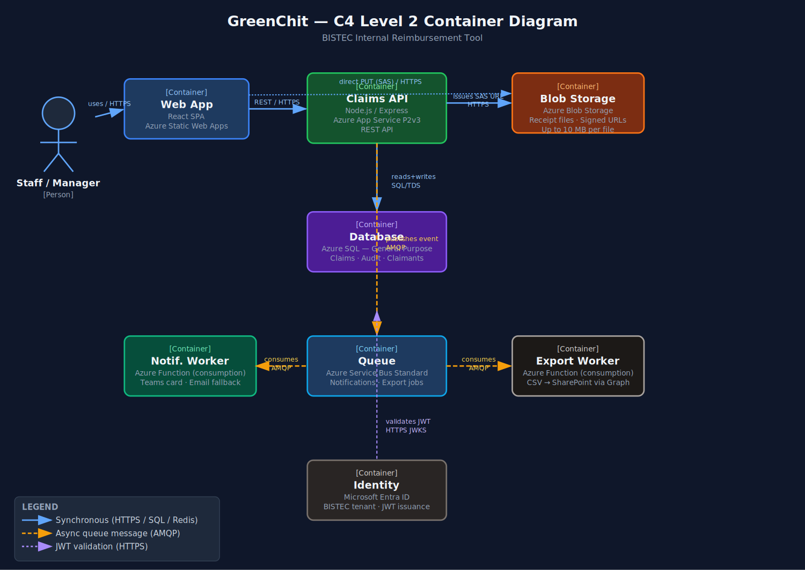
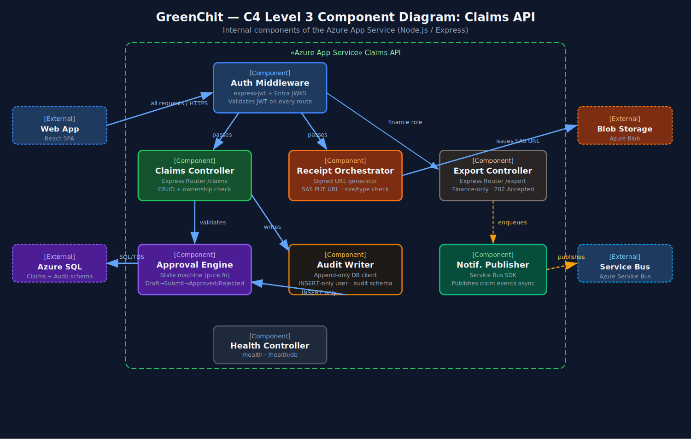

# GreenChit — Architecture Design Pack

## 1. System Context (one-paragraph recap of Day 1-style context)

GreenChit is an internal BISTEC reimbursement tool that lets staff submit expense claims, attach receipts, and receive manager approval before payroll picks them up. Staff access GreenChit through a web app secured by Microsoft Entra ID SSO. The system runs on Azure, sends manager notifications through Microsoft Teams, and exports approved claims as CSV files into a SharePoint folder used by the existing payroll automation. Finance users can trigger exports without connecting directly to the payroll system. Every claim state change is written to an audit log and retained for 7 years to satisfy company finance policy.

---

## 2. Containers (C4 Level 2) — embedded PNG + table of containers

> SVG source also available at `diagrams/container-diagram.svg`

| Container | Technology | Responsibility |
|-----------|------------|----------------|
| **Web App** | React SPA, Azure Static Web Apps | Member-facing UI for submitting claims, viewing status, attaching receipts, and approving claims. Runs in the browser and calls the Claims API over HTTPS. |
| **Claims API** | Node.js / Express, Azure App Service (P2v3) | Central backend for authentication checks, claim lifecycle logic, receipt upload orchestration, CSV export requests, and audit writes. |
| **Database** | Azure SQL (General Purpose, 4 vCores) | Relational store of record for claims, claimants, audit log rows, and export job state. ACID transactions protect status changes. |
| **Blob Storage** | Azure Blob Storage (Hot tier) | Stores receipt files such as JPEG, PNG, and PDF files. Files are accessed using signed URLs and are not streamed through the API. |
| **Queue** | Azure Service Bus (Standard tier) | Decouples notification delivery and CSV export jobs from synchronous HTTP requests. |
| **Notification Worker** | Node.js Azure Function (consumption plan) | Consumes claim notification messages and sends Teams Adaptive Card notifications with email fallback. |
| **Export Worker** | Node.js Azure Function (consumption plan) | Consumes export request messages, builds CSV files from approved claims, and drops them into SharePoint through Graph API. |
| **Identity** | Microsoft Entra ID (BISTEC tenant) | Provides SSO and JWT tokens. Every protected API call carries a Bearer token validated against Entra ID. |
| **Audit Store** | Azure SQL `audit_log` table | Append-only audit log for every claim state transition. Written by the Claims API using a database user with INSERT-only permissions. |

---

## 3. Components (C4 Level 3) for the API service — embedded PNG + table of components

> SVG source also available at `diagrams/component-diagram.svg`

| Component | Technology | Responsibility |
|-----------|------------|----------------|
| **Auth Middleware** | `express-jwt` + Entra JWKS | Validates Bearer JWTs on protected routes and extracts `memberId`, `managerId`, and `role` claims. Rejects invalid or expired tokens with 401. |
| **Claims Controller** | Express Router (`/claims`) | Handles claim creation, claim lookup, and claim status changes. Enforces ownership rules for claimants and line managers. |
| **Receipt Orchestrator** | Signed URL generator | Issues time-limited Azure Blob SAS upload URLs so the browser can upload receipts directly to Blob Storage. Validates declared file size and extension before issuing URLs. |
| **Approval Engine** | State machine | Enforces valid claim status transitions such as Draft to Submitted and Submitted to Approved or Rejected. Rejects invalid transitions with 409. |
| **Export Controller** | Express Router (`/export`) | Finance-only endpoint for requesting approved-claim exports. Enqueues an `export.requested` message and returns 202 Accepted. |
| **Audit Writer** | Append-only DB client | Writes audit rows for every claim state transition, including actor, timestamp, previous state, new state, and rejection reason when applicable. |
| **Notification Publisher** | Azure Service Bus SDK | Publishes structured claim messages such as `claim.submitted`, `claim.approved`, and `claim.rejected` after successful state changes. |
| **Health Controller** | Express Router (`/health`, `/health/db`) | Provides liveness and readiness endpoints for App Service monitoring and Azure Monitor checks. |

---

## 4. Reading order — how a reviewer should walk through the diagrams

**1. Start with the container diagram**

Walk from the user-facing Web App to the Claims API. Then follow the API connections to Identity, Database, Blob Storage, Queue, Workers, SharePoint, Teams, and the Audit Store.

**2. Check the main synchronous path**

Follow the normal request flow:

- user logs in through Microsoft Entra ID
- Web App calls the Claims API
- Claims API validates the JWT
- Claims API reads or writes claim data in Azure SQL
- Claims API writes audit records for state changes

**3. Check the receipt upload path**

Follow the receipt flow:

- Web App asks the Claims API for signed upload URLs
- Claims API returns SAS URLs
- browser uploads receipts directly to Blob Storage
- receipt metadata is stored in Azure SQL

**4. Check the asynchronous worker path**

Follow the queue-based flow:

- Claims API publishes messages to Azure Service Bus
- Notification Worker sends Teams or email messages
- Export Worker creates approved-claims CSV files
- CSV files are dropped into SharePoint for payroll automation

**5. Open the component diagram**

Review the internals of the Claims API:

- Auth Middleware protects requests
- Claims Controller handles claim routes
- Approval Engine controls state changes
- Receipt Orchestrator handles signed URLs
- Audit Writer records state transitions
- Notification Publisher sends async messages
- Export Controller handles finance export requests
- Health Controller supports monitoring

**6. Open the sequence diagram**

Use `diagrams/sequence-submit-approve.md` to verify:

- happy path claim submission and approval
- receipt upload failure handling
- unauthorised manager approval handling
- synchronous request steps
- asynchronous queue-based steps
